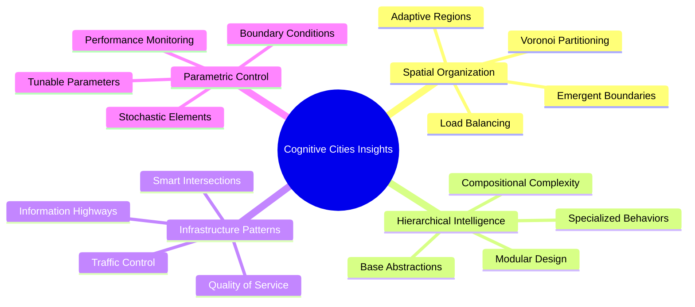

# Research Index: City Model Insights for Cognitive Cities

This research collection analyzes the `city-model-example` to extract insights for cognitive city architectures. The city model provides a sophisticated framework for procedural 3D city generation that reveals fundamental principles applicable to distributed intelligence systems.

## Research Documents

### 1. [City Model Analysis](./city-model-analysis.md)
**Comprehensive overview of the city model architecture and its implications for cognitive cities**

- System architecture overview with Mermaid and PlantUML diagrams
- Key technical patterns: Voronoi diagrams, hierarchical objects, parametric control
- Insights for spatial intelligence organization and emergent complexity
- Implementation patterns for distributed intelligence systems

### 2. [Voronoi Cognitive Organization](./voronoi-cognitive-organization.md)
**Deep dive into spatial intelligence organization using Voronoi diagram principles**

- Mathematical foundations of Voronoi diagrams for cognitive space partitioning
- Dynamic adaptation algorithms for cognitive load balancing
- Implementation patterns for cognitive control points and information routing
- Applications in emergency response, urban planning, and service delivery

### 3. [Infrastructure Intelligence Pathways](./infrastructure-intelligence-pathways.md)
**Analysis of road networks as models for information infrastructure in cognitive cities**

- Hierarchical pathway architecture with bandwidth management
- Smart intersection intelligence for information routing
- Traffic control patterns for cognitive load management
- Quality of service frameworks for different information types

## Key Insights Summary

### Fundamental Principles

### Technical Architecture Patterns

1. **Procedural Generation**: Using mathematical algorithms (Voronoi diagrams) to create natural-looking organizational structures
2. **Object-Oriented Hierarchy**: Base classes with specialized implementations for different cognitive domains
3. **Geometric Computing**: Sophisticated spatial calculations for managing relationships and boundaries
4. **Infrastructure Systems**: Multi-layered communication and coordination mechanisms

### Cognitive City Applications

1. **Emergency Response Networks**: Adaptive spatial partitioning for crisis management
2. **Governance Intelligence**: Hierarchical decision-making with smart information routing
3. **Service Delivery Optimization**: Dynamic boundary adjustment based on demand patterns
4. **Urban Planning Intelligence**: Collaborative decision-making with spatial awareness

## Implementation Roadmap

### Phase 1: Foundation Components
- [ ] Implement cognitive Voronoi partitioning system
- [ ] Develop hierarchical cognitive object framework
- [ ] Create basic information pathway infrastructure
- [ ] Build parametric tuning system

### Phase 2: Intelligence Networks
- [ ] Deploy adaptive boundary algorithms
- [ ] Implement smart intersection routing
- [ ] Create quality of service frameworks
- [ ] Build load balancing mechanisms

### Phase 3: Advanced Capabilities
- [ ] Self-optimizing network algorithms
- [ ] Predictive traffic management
- [ ] Multi-scale coordination systems
- [ ] Emergency response protocols

### Phase 4: Integration & Scale
- [ ] City-scale deployment patterns
- [ ] Inter-city cognitive networks
- [ ] Performance monitoring systems
- [ ] Evolutionary optimization

## Technical Specifications

### Core Technologies
- **Spatial Computing**: Voronoi diagrams, geometric algorithms, spatial data structures
- **Network Architecture**: Hierarchical routing, quality of service, load balancing
- **Intelligence Frameworks**: Distributed decision-making, adaptive algorithms, emergent behavior
- **Performance Systems**: Real-time monitoring, optimization, predictive analytics

### Development Environment
- **Languages**: Python for cognitive algorithms, C++ for performance-critical components
- **Frameworks**: NetworkX for graph algorithms, SciPy for spatial computing, distributed computing frameworks
- **Visualization**: Mermaid diagrams, PlantUML, 3D visualization tools
- **Testing**: Simulation environments, performance benchmarks, scalability tests

## Research Methodology

### Analysis Approach
1. **Code Analysis**: Detailed examination of city model source code
2. **Pattern Extraction**: Identification of reusable architectural patterns
3. **Cognitive Mapping**: Translation of physical patterns to cognitive equivalents
4. **Prototype Development**: Implementation of key concepts in cognitive city context

### Validation Criteria
- **Scalability**: Can patterns handle city-scale complexity?
- **Adaptability**: Do systems respond to changing conditions?
- **Efficiency**: Are computational resources used optimally?
- **Emergent Behavior**: Do simple rules create sophisticated behaviors?

## Future Research Directions

### 1. Temporal Dynamics
- Time-based Voronoi diagrams that evolve with changing conditions
- Historical pattern recognition and predictive boundary adjustment
- Long-term learning and adaptation mechanisms

### 2. Multi-Dimensional Cognitive Space
- High-dimensional cognitive spaces beyond physical geography
- Complex distance metrics incorporating semantic, temporal, and social factors
- Machine learning-enhanced spatial organization

### 3. Cross-Scale Integration
- Coordination between neighborhood, district, and city-scale intelligence
- Hierarchical communication protocols
- Emergent organization across multiple scales

### 4. Resilience and Robustness
- Fault-tolerant cognitive network design
- Graceful degradation under stress conditions
- Recovery and adaptation mechanisms

## Related Work

### Academic References
- Voronoi diagrams in computational geometry
- Distributed systems and network topology
- Spatial data structures and algorithms
- Emergence and complexity theory

### Industry Applications
- Smart city initiatives and intelligent infrastructure
- Distributed computing and cloud architecture
- Traffic management and transportation systems
- Emergency response and crisis management

## Contributing to Research

### Code Contributions
- Implementation of cognitive algorithms based on city model patterns
- Performance optimizations and scalability improvements
- Testing frameworks and validation tools

### Research Extensions
- New applications of spatial computing to cognitive cities
- Novel adaptations of geometric algorithms
- Integration with existing urban systems

### Documentation
- Additional analysis documents for specific aspects
- Implementation guides and tutorials
- Case studies and real-world applications

---

*This research collection provides a foundation for applying sophisticated spatial and organizational patterns from procedural city generation to the design of cognitive city intelligence networks. The insights reveal how mathematical principles, hierarchical organization, and infrastructure patterns can inform the development of adaptive, scalable, and efficient distributed intelligence systems for urban environments.*