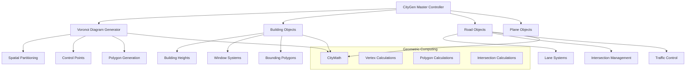
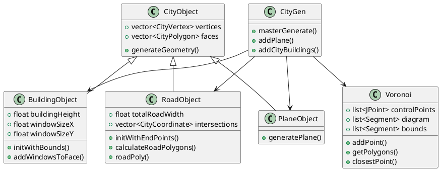
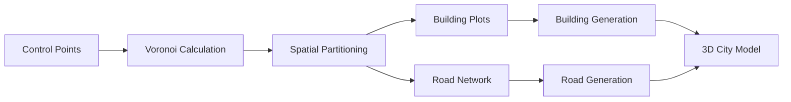
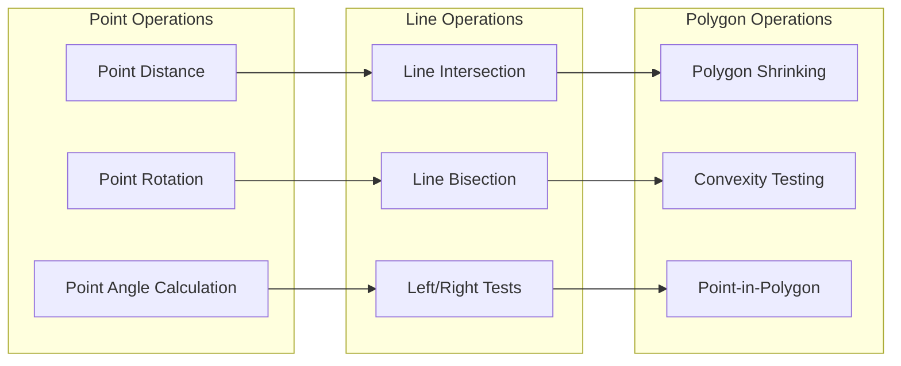
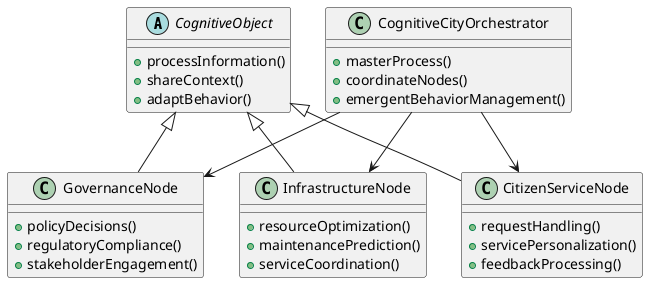

# City Model Analysis: Insights for Cognitive Cities

## Executive Summary

The `city-model-example` provides a sophisticated 3D procedural city generation system that offers profound insights for cognitive city architectures. This analysis examines the technical patterns, spatial computing approaches, and organizational principles that can inform our broader cognitive cities project.

## System Architecture Overview

### Core Components

The city model demonstrates a hierarchical, object-oriented architecture with several key subsystems:



### Technical Architecture



## Key Technical Patterns

### 1. Procedural Generation via Voronoi Diagrams

The system uses Voronoi diagrams for spatial partitioning, which creates natural-looking urban layouts:

- **Mathematical Foundation**: Based on closest-point algorithms
- **Emergent Properties**: Creates organic-looking boundaries and neighborhoods
- **Scalability**: Computationally efficient for large areas
- **Adaptability**: Can incorporate constraints and control points



### 2. Hierarchical Object System

The inheritance hierarchy demonstrates modularity and extensibility:

- **Base Abstraction**: CityObject provides common vertex/face management
- **Specialized Behaviors**: Each subclass handles domain-specific logic
- **Geometric Consistency**: Shared mathematical operations ensure coherence
- **Resource Management**: Efficient memory and computational resource use

### 3. Parametric Control Systems

The system uses constants and parameters for fine-tuning:

```c++
#define MINX -100
#define MAXX 100
#define MINZ -200
#define MAXZ 0
#define RANDSEED 32
#define NUMCONTROL 10
#define MINHEIGHT 2
#define CONST_LANE_SIZE 0.5
#define CONST_SIDEWALK_SIZE 0.2
```

This suggests cognitive cities need:
- **Tunable Intelligence Parameters**: Adjustable cognitive processing weights
- **Boundary Conditions**: Defined operational limits
- **Stochastic Elements**: Controlled randomness for emergent behaviors
- **Scale Constants**: Size and proportion management

## Insights for Cognitive Cities

### 1. Spatial Intelligence Organization

**Pattern**: Voronoi diagrams create natural spatial divisions
**Cognitive Implication**: Information processing regions should emerge organically based on:
- Data density (like control points)
- Processing requirements (like building types)
- Communication efficiency (like road networks)

### 2. Hierarchical Processing Architecture

**Pattern**: Object inheritance with specialized behaviors
**Cognitive Implication**: Cognitive cities need layered intelligence:
- **Base Layer**: Common cognitive operations (like CityObject)
- **Specialized Layers**: Domain-specific intelligence (like BuildingObject for governance, RoadObject for logistics)
- **Coordination Layer**: Master orchestration (like CityGen)

### 3. Infrastructure as Intelligence Pathways

**Pattern**: Roads aren't just connections - they're sophisticated systems with lanes, intersections, traffic control
**Cognitive Implication**: Information pathways in cognitive cities should have:
- **Bandwidth Management**: Like road widths and lane counts
- **Intersection Intelligence**: Smart routing and conflict resolution
- **Traffic Control**: Dynamic flow management based on cognitive load

### 4. Emergent Complexity from Simple Rules

**Pattern**: Complex city layouts emerge from simple geometric rules
**Cognitive Implication**: Cognitive cities can achieve sophisticated behaviors through:
- **Simple Base Rules**: Like distance calculations and boundary checks
- **Iterative Application**: Repeated application of rules creates complexity
- **Constraint Satisfaction**: Respecting boundaries and relationships

### 5. Parametric Adaptability

**Pattern**: Behavior controlled through adjustable parameters
**Cognitive Implication**: Cognitive cities need:
- **Performance Tuning**: Adjustable intelligence parameters
- **Environmental Adaptation**: Parameters that respond to changing conditions
- **Evolutionary Capability**: Parameters that learn and improve over time

## Geometric Computing Insights

### Mathematical Foundations

The city model demonstrates sophisticated geometric computing:



**For Cognitive Cities**: Spatial relationships are fundamental to:
- **Information Topology**: How data and decisions relate spatially
- **Influence Networks**: Who/what affects whom in what regions
- **Resource Allocation**: Optimal distribution of cognitive resources
- **Communication Patterns**: Efficient information flow pathways

## Implementation Patterns for Cognitive Cities

### 1. Cognitive Voronoi Partitioning

Instead of physical space, partition cognitive space:
- **Decision Domains**: Each region handles specific types of decisions
- **Information Neighborhoods**: Related data clusters naturally
- **Processing Boundaries**: Clear delineation of responsibilities
- **Adaptive Regions**: Boundaries adjust based on cognitive load

### 2. Intelligence Infrastructure

Model cognitive pathways like road systems:
- **Information Highways**: High-bandwidth channels for critical data
- **Local Networks**: Fine-grained information distribution
- **Intersection Logic**: Smart routing and conflict resolution
- **Traffic Management**: Dynamic load balancing

### 3. Hierarchical Cognitive Objects

Implement layered intelligence:



## Implications for Distributed Intelligence

### 1. Self-Organizing Cognitive Networks

The Voronoi approach suggests cognitive cities should:
- **Allow Emergent Organization**: Don't over-design the intelligence topology
- **Use Mathematical Principles**: Leverage proven spatial algorithms
- **Enable Adaptive Boundaries**: Let cognitive regions adjust to demand
- **Optimize for Efficiency**: Minimize communication overhead

### 2. Scalable Processing Architecture

The hierarchical object model suggests:
- **Modular Intelligence**: Each cognitive node has specific capabilities
- **Shared Infrastructure**: Common base functionality (like CityObject)
- **Specialized Behaviors**: Domain-specific intelligence (like building types)
- **Compositional Complexity**: Complex behaviors from simple components

### 3. Dynamic Resource Management

The parametric control suggests:
- **Tunable Performance**: Adjustable intelligence parameters
- **Resource Constraints**: Defined operational boundaries
- **Adaptive Algorithms**: Parameters that learn and evolve
- **Performance Monitoring**: Continuous optimization capabilities

## Next Steps for Cognitive Cities Implementation

### 1. Prototype Cognitive Voronoi System
- Implement information space partitioning
- Test adaptive boundary algorithms
- Measure efficiency vs. traditional architectures

### 2. Develop Hierarchical Intelligence Framework
- Create base cognitive object abstraction
- Implement specialized intelligence nodes
- Build orchestration and coordination systems

### 3. Design Information Infrastructure
- Model communication pathways like road networks
- Implement smart routing and conflict resolution
- Build dynamic load balancing capabilities

### 4. Create Parametric Tuning System
- Identify key cognitive performance parameters
- Implement adaptive parameter adjustment
- Build monitoring and optimization systems

## Conclusion

The city model example provides a rich foundation for thinking about cognitive cities. Its use of mathematical spatial algorithms, hierarchical organization, and parametric control offers concrete patterns we can adapt for distributed intelligence systems. The key insight is that just as cities emerge from simple rules applied consistently across space, cognitive cities can achieve sophisticated intelligence through well-designed base patterns that scale and adapt naturally.

The geometric computing foundations remind us that spatial relationships - whether physical or abstract - are fundamental to complex systems. For cognitive cities, this means careful attention to information topology, communication pathways, and the spatial organization of intelligence itself.