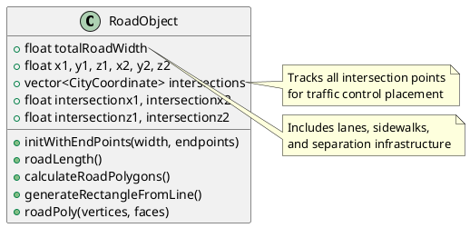
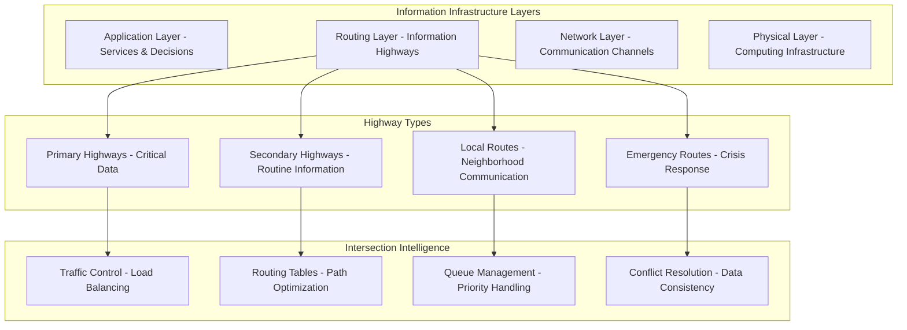
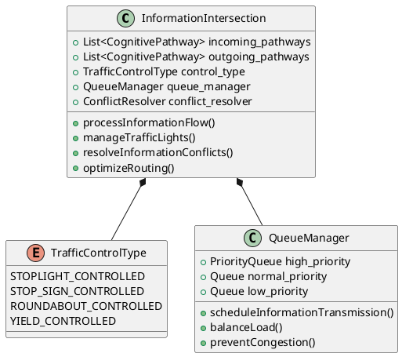
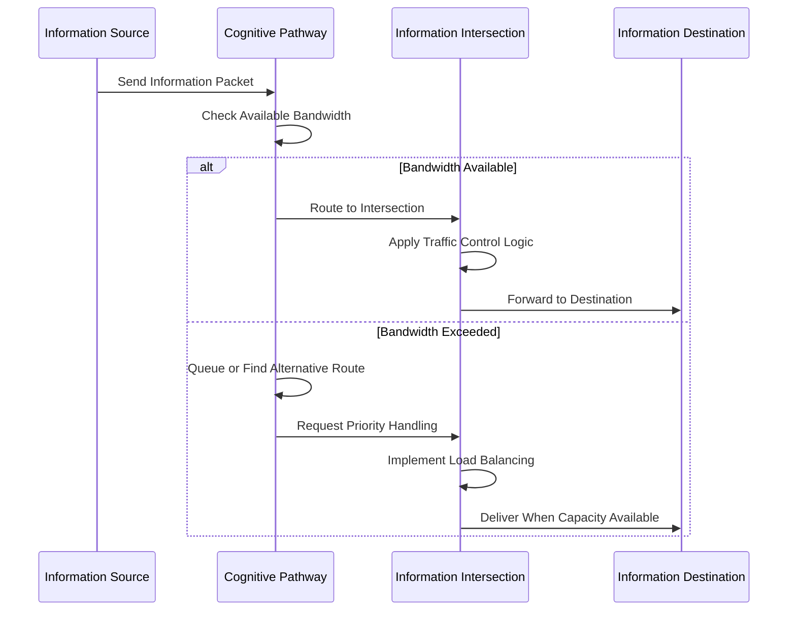
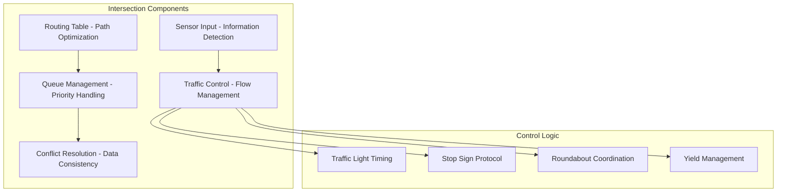
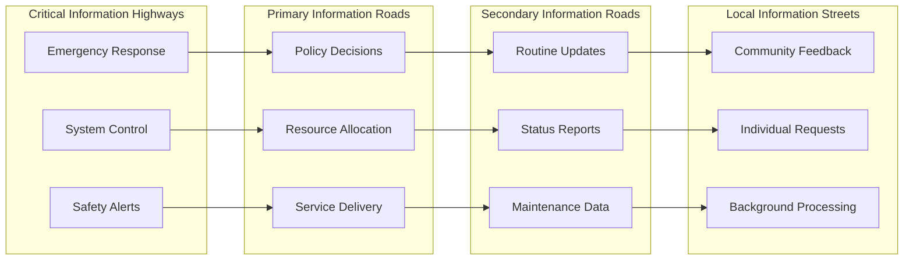

# Infrastructure as Intelligence: Road Networks and Information Pathways

## Overview

The city model's sophisticated road generation system provides crucial insights for designing information infrastructure in cognitive cities. This analysis examines how physical transportation networks can inform the design of cognitive information pathways.

## Road Network Architecture from City Model

### Hierarchical Road Systems

The city model implements a two-tier road system:

```cpp
// From CityGen.mm - Primary roads (6.0 width)
for(list<Segment>::iterator sit = city.second.first.begin(); sit != city.second.first.end(); ++sit){
    RoadObject * tmp = [[RoadObject alloc] initWithEndPoints:6.0 x1:(*sit).p.x y1:-.9 z1:(*sit).p.y x2:(*sit).q.x y2:-0.9 z2:(*sit).q.y];
    if ([tmp roadLength] > 5.0) {
        pregenList.coordinates[STOPLIGHT_INDEX].insert(pregenList.coordinates[STOPLIGHT_INDEX].end(), tmpV.begin(), tmpV.end());
    }
}

// Secondary roads (3.0 width)  
for(list<Segment>::iterator sit = city.second.second.begin(); sit != city.second.second.end(); ++sit){
    RoadObject * tmp =[[RoadObject alloc] initWithEndPoints:3.0 x1:(*sit).p.x y1:-.9 z1:(*sit).p.y x2:(*sit).q.x y2:-0.9 z2:(*sit).q.y];
    if ([tmp roadLength] > 5.0) {
        pregenList.coordinates[STOPSIGN_INDEX].insert(pregenList.coordinates[STOPSIGN_INDEX].end(), tmpV.begin(), tmpV.end());
    }
}
```

This reveals key principles:
- **Bandwidth Hierarchy**: Different road widths for different traffic volumes
- **Traffic Control**: Intelligent intersection management (stoplights vs stop signs)
- **Length Thresholds**: Only significant roads get traffic control infrastructure
- **Coordinate Management**: Systematic tracking of intersection points

### Road Object Structure



### Infrastructure Components

From `RoadObject.h` constants:

```cpp
#define CONST_LANE_SIZE 0.5
#define CONST_SIDEWALK_SIZE 0.2
#define CONST_INTERSECTION_SIZE totalRoadWidth/2
#define CONST_LANE_SEPERATOR_SIZE 0.2
```

This sophisticated infrastructure includes:
- **Lanes**: Primary traffic flow channels
- **Sidewalks**: Alternative traffic (pedestrians)
- **Intersections**: Smart routing and conflict resolution zones
- **Lane Separators**: Traffic organization and safety

## Cognitive Information Pathways

### Information Highway Architecture

Translating road network principles to cognitive cities:



### Cognitive Road Object

```python
class CognitivePathway:
    def __init__(self, source, destination, bandwidth, priority_level):
        self.source = source
        self.destination = destination
        self.bandwidth = bandwidth  # Information capacity
        self.priority_level = priority_level  # Like road width/type
        self.current_load = 0
        self.intersections = []  # Smart routing points
        self.quality_metrics = PathwayMetrics()
        
    def transmit_information(self, information_packet):
        if self.current_load + information_packet.size <= self.bandwidth:
            return self.route_information(information_packet)
        else:
            return self.request_alternative_route(information_packet)
    
    def calculate_pathway_geometry(self):
        """Like generateRectangleFromLine but for information flow"""
        return self.optimize_information_flow_geometry()
```

### Information Traffic Control



## Traffic Flow Patterns in Cognitive Cities

### Load Balancing Algorithms

Inspired by the city model's intersection management:

```python
class CognitiveTrafficControl:
    def __init__(self):
        self.intersection_type = self.determine_control_type()
        self.signal_timing = self.optimize_signal_timing()
        
    def determine_control_type(self):
        """
        Like the city model's logic:
        - Primary roads (high bandwidth) get stoplights
        - Secondary roads get stop signs
        - Local routes might use yield or roundabout logic
        """
        if self.primary_pathway_count >= 2:
            return TrafficControlType.STOPLIGHT_CONTROLLED
        elif self.secondary_pathway_count >= 2:
            return TrafficControlType.STOP_SIGN_CONTROLLED
        else:
            return TrafficControlType.YIELD_CONTROLLED
    
    def process_information_traffic(self, incoming_info):
        """Smart intersection processing"""
        if self.control_type == TrafficControlType.STOPLIGHT_CONTROLLED:
            return self.manage_stoplight_flow(incoming_info)
        elif self.control_type == TrafficControlType.STOP_SIGN_CONTROLLED:
            return self.manage_stop_sign_flow(incoming_info)
        else:
            return self.manage_yield_flow(incoming_info)
```

### Bandwidth Management



## Smart Infrastructure Components

### Lane Management

Cognitive equivalent of road lanes:

```python
class InformationLane:
    def __init__(self, lane_type, priority, bandwidth):
        self.lane_type = lane_type  # CRITICAL, NORMAL, BACKGROUND
        self.priority = priority
        self.bandwidth = bandwidth
        self.current_traffic = []
        
    def can_accept_information(self, info_packet):
        """Like checking if a vehicle can merge into a lane"""
        required_bandwidth = info_packet.size
        available_bandwidth = self.bandwidth - self.current_utilization()
        
        return (required_bandwidth <= available_bandwidth and 
                info_packet.priority >= self.minimum_priority)

class CognitiveLaneManager:
    def __init__(self):
        self.critical_lane = InformationLane("CRITICAL", 9, 1000)
        self.normal_lane = InformationLane("NORMAL", 5, 500) 
        self.background_lane = InformationLane("BACKGROUND", 1, 100)
        
    def assign_lane(self, information):
        """Smart lane assignment like traffic management"""
        if information.priority >= 8:
            return self.critical_lane
        elif information.priority >= 3:
            return self.normal_lane
        else:
            return self.background_lane
```

### Intersection Intelligence



## Implementation Patterns

### 1. Pathway Construction

```python
def construct_cognitive_pathway(start_node, end_node, pathway_type):
    """
    Like the city model's generateRectangleFromLine
    but for information pathways
    """
    # Calculate optimal pathway geometry
    pathway_width = determine_bandwidth_requirements(pathway_type)
    
    # Generate pathway infrastructure
    lanes = create_information_lanes(pathway_width)
    intersections = identify_intersection_points(start_node, end_node)
    
    # Add traffic control infrastructure
    for intersection in intersections:
        control_type = determine_traffic_control(intersection)
        intersection.add_traffic_control(control_type)
    
    return CognitivePathway(start_node, end_node, lanes, intersections)
```

### 2. Network Optimization

```python
class CognitiveNetworkOptimizer:
    def __init__(self, network_graph):
        self.network = network_graph
        self.traffic_patterns = TrafficAnalyzer()
        
    def optimize_pathway_widths(self):
        """
        Dynamically adjust pathway bandwidth like
        adding/removing lanes based on traffic
        """
        for pathway in self.network.pathways:
            utilization = self.traffic_patterns.get_utilization(pathway)
            
            if utilization > 0.8:  # High traffic
                pathway.add_lanes(1)
            elif utilization < 0.2:  # Low traffic
                pathway.remove_lanes(1)
    
    def optimize_intersection_timing(self):
        """
        Adjust traffic control timing based on
        information flow patterns
        """
        for intersection in self.network.intersections:
            flow_data = self.traffic_patterns.get_intersection_flows(intersection)
            intersection.optimize_signal_timing(flow_data)
```

### 3. Emergency Routing

```python
class EmergencyInformationRouting:
    def __init__(self, network):
        self.network = network
        self.emergency_protocols = EmergencyProtocols()
        
    def handle_emergency_information(self, emergency_info):
        """
        Like emergency vehicle routing - clear paths
        and prioritize critical information
        """
        # Clear emergency pathway
        emergency_route = self.find_fastest_route(emergency_info)
        self.clear_pathway(emergency_route)
        
        # Override normal traffic control
        for intersection in emergency_route.intersections:
            intersection.enable_emergency_mode()
        
        # Transmit with highest priority
        return self.transmit_emergency_information(emergency_info, emergency_route)
```

## Quality of Service Patterns

### Information Traffic Classes

Based on road hierarchy principles:



### Performance Metrics

```python
class PathwayPerformanceMetrics:
    def __init__(self):
        self.throughput = 0  # Information packets per second
        self.latency = 0     # Average transmission time
        self.reliability = 0 # Successful transmission rate
        self.utilization = 0 # Bandwidth usage percentage
        
    def calculate_quality_of_service(self):
        """
        Like measuring traffic flow efficiency
        but for information pathways
        """
        return {
            'response_time': self.latency,
            'availability': self.reliability,
            'capacity_utilization': self.utilization,
            'congestion_level': self.calculate_congestion()
        }
```

## Applications in Cognitive Cities

### 1. Crisis Communication Networks

- **Emergency Highways**: Dedicated high-bandwidth channels for crisis information
- **Intersection Override**: Emergency protocols that override normal routing
- **Load Shedding**: Temporarily reduce non-critical traffic during emergencies
- **Redundant Pathways**: Multiple routes for critical information reliability

### 2. Governance Information Flow

- **Policy Highways**: High-priority channels for policy information
- **Citizen Feedback Roads**: Structured pathways for community input
- **Administrative Networks**: Efficient routing for routine governance
- **Transparency Channels**: Public access to government information

### 3. Service Delivery Networks

- **Service Request Routing**: Efficient pathways from citizens to service providers
- **Resource Coordination**: Inter-agency information sharing
- **Performance Monitoring**: Real-time service quality information
- **Adaptive Service Networks**: Networks that adjust to service demand patterns

## Future Developments

### 1. Self-Optimizing Networks

Networks that automatically adjust their structure based on usage patterns:

```python
class SelfOptimizingCognitiveNetwork:
    def __init__(self):
        self.learning_algorithm = NetworkOptimizationAI()
        self.adaptation_triggers = AdaptationTriggers()
        
    def continuous_optimization(self):
        while self.is_active():
            traffic_patterns = self.analyze_traffic_patterns()
            optimization_opportunities = self.identify_optimizations(traffic_patterns)
            self.implement_optimizations(optimization_opportunities)
            self.monitor_optimization_results()
```

### 2. Predictive Traffic Management

Like smart traffic systems that predict and prevent congestion:

```python
class PredictiveInformationTrafficManagement:
    def __init__(self):
        self.prediction_model = TrafficPredictionAI()
        self.preemptive_controls = PreemptiveTrafficControls()
        
    def predict_and_prevent_congestion(self):
        predicted_bottlenecks = self.prediction_model.forecast_congestion()
        for bottleneck in predicted_bottlenecks:
            self.preemptive_controls.implement_prevention_strategy(bottleneck)
```

## Conclusion

The city model's road network architecture provides a sophisticated framework for designing information infrastructure in cognitive cities. Key insights include:

1. **Hierarchical Design**: Different bandwidth requirements need different pathway types
2. **Smart Intersections**: Intelligent routing and conflict resolution are crucial
3. **Quality of Service**: Infrastructure must support different priority levels
4. **Adaptive Management**: Networks must respond to changing traffic patterns
5. **Emergency Capabilities**: Critical information needs priority routing mechanisms

By modeling information flow after transportation networks, cognitive cities can achieve efficient, reliable, and scalable information infrastructure that supports complex decision-making and service delivery across distributed urban systems.