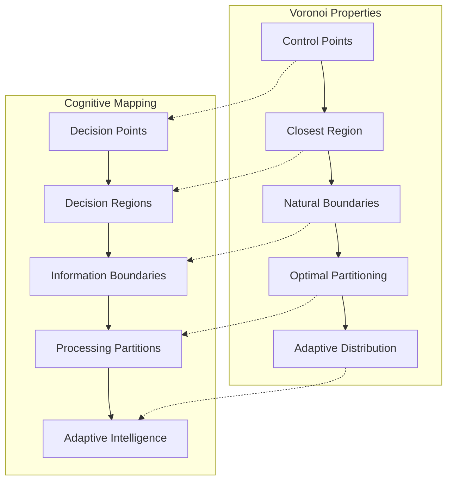
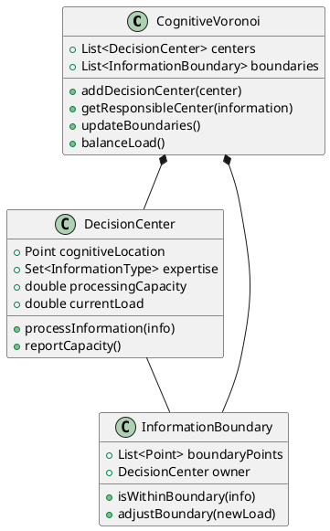
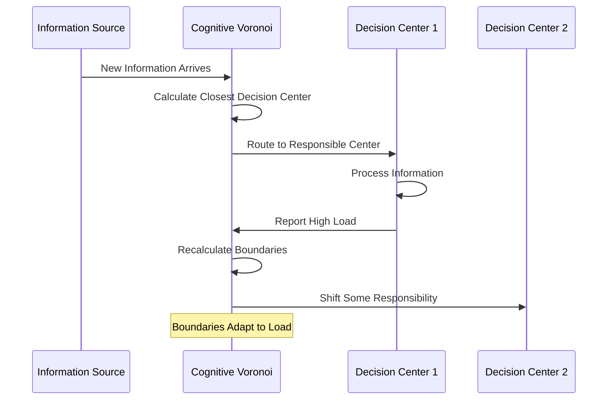
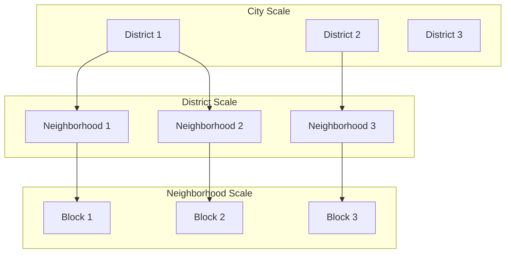
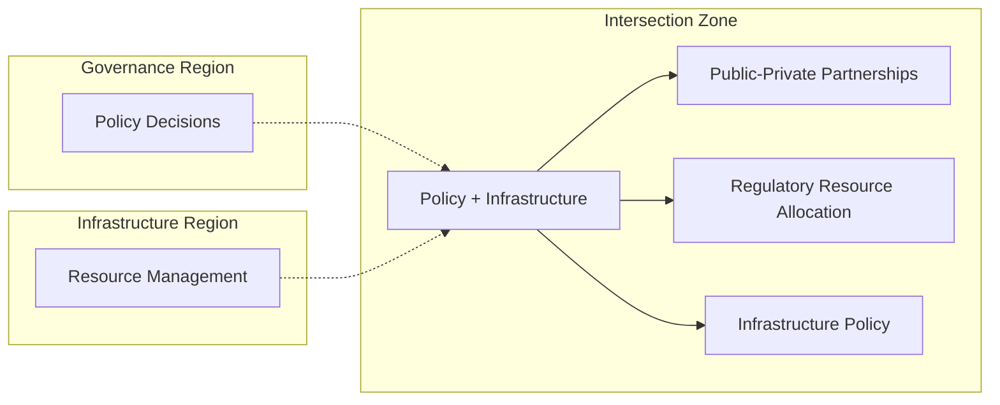
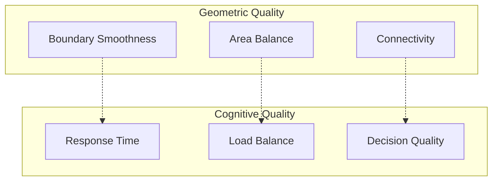

# Voronoi Diagrams for Cognitive Cities: Spatial Intelligence Organization

## Overview

The city model's use of Voronoi diagrams for spatial partitioning reveals fundamental principles for organizing cognitive intelligence in distributed systems. This document explores how Voronoi-based spatial algorithms can inform cognitive city architectures.

## Mathematical Foundation

### Voronoi Diagram Properties

A Voronoi diagram partitions space based on distance to a specific set of points (called sites or control points). For each site, there is a corresponding region consisting of all points closer to that site than to any other.



### Key Algorithmic Insights

From the city model's `voronoi.h` implementation:

1. **Incremental Construction**: Points are added one at a time, with the diagram updated incrementally
2. **Efficient Queries**: Closest point lookup in O(n) time
3. **Boundary Management**: Explicit handling of diagram boundaries
4. **Intersection Computing**: Sophisticated line and segment intersection algorithms

```cpp
// Key pattern from voronoi.h
void addPoint(JPoint a) {
    // Check if point is within bounds
    if(!isIn(a, bounds)) return;
    
    // For each existing control point
    for(list<JPoint>::iterator pit = controlPoints.begin(); pit != controlPoints.end(); ++pit) {
        // Create bisector line
        JLine bi = Segment(a, *pit).Bisector();
        // Update diagram incrementally
        // ... sophisticated geometric calculations
    }
    controlPoints.push_back(a);
}
```

## Cognitive Space Partitioning

### Information Territories

Just as Voronoi diagrams create spatial territories around control points, cognitive cities can create information territories around decision centers:



### Dynamic Adaptation

Unlike static physical spaces, cognitive spaces can adapt dynamically:



## Cognitive Load Balancing

### Adaptive Boundary Adjustment

The city model's polygon shrinking algorithm provides a pattern for cognitive load management:

```cpp
// Adapted from city model's Shrink function
CognitiveBoundary shrinkCognitiveRegion(CognitiveRegion region, double loadFactor) {
    // Reduce region size based on cognitive load
    // Similar to geometric shrinking but based on information density
    return adaptBoundaryToLoad(region.boundary, loadFactor);
}
```

### Multi-Scale Organization



**Cognitive Equivalent**:
- **City Scale**: Major policy domains (governance, infrastructure, services)
- **District Scale**: Functional areas within domains (transportation, utilities, health)
- **Neighborhood Scale**: Specific decision units (traffic management, power grid zones, hospital networks)

## Implementation Patterns

### 1. Cognitive Control Points

```python
class CognitiveControlPoint:
    def __init__(self, location, expertise_domains, capacity):
        self.location = location  # Position in cognitive space
        self.expertise = expertise_domains  # What types of decisions this handles
        self.capacity = capacity  # Maximum cognitive load
        self.current_load = 0
        self.influence_radius = self.calculate_initial_radius()
    
    def process_information(self, info):
        if self.current_load < self.capacity:
            decision = self.make_decision(info)
            self.current_load += info.complexity
            return decision
        else:
            return self.request_load_balancing(info)
```

### 2. Information Routing

```python
class CognitiveVoronoiRouter:
    def __init__(self):
        self.control_points = []
        self.boundaries = []
    
    def route_information(self, information):
        # Find closest cognitive control point
        closest_point = self.find_closest_point(information)
        
        # Check if point is overloaded
        if closest_point.is_overloaded():
            # Trigger boundary recalculation
            self.recalculate_boundaries()
            closest_point = self.find_closest_available_point(information)
        
        return closest_point.process_information(information)
```

### 3. Dynamic Boundary Updates

```python
def update_cognitive_boundaries(self, load_report):
    """
    Update Voronoi boundaries based on cognitive load
    Similar to the city model's incremental point addition
    """
    for center in self.control_points:
        if center.is_overloaded():
            # Shrink influence region
            center.influence_radius *= 0.9
        elif center.is_underutilized():
            # Expand influence region
            center.influence_radius *= 1.1
    
    # Recalculate Voronoi diagram with new influence radii
    self.recalculate_voronoi_weighted()
```

## Spatial Cognitive Algorithms

### Distance Metrics in Cognitive Space

Physical distance becomes cognitive distance:

```python
def cognitive_distance(info, decision_center):
    """
    Calculate cognitive distance based on:
    - Semantic similarity
    - Processing compatibility
    - Current load
    - Historical performance
    """
    semantic_dist = calculate_semantic_distance(info.type, decision_center.expertise)
    load_penalty = decision_center.current_load / decision_center.capacity
    performance_bonus = decision_center.historical_success_rate
    
    return semantic_dist * (1 + load_penalty) * (2 - performance_bonus)
```

### Intersection Intelligence

Like the geometric intersection calculations in the city model, cognitive boundaries can have intelligent intersections:



## Applications in Cognitive Cities

### 1. Emergency Response Coordination

- **Control Points**: Emergency response centers
- **Information**: Incident reports, resource requests
- **Boundaries**: Responsibility regions that adapt to incident severity
- **Load Balancing**: Automatic rerouting when centers are overwhelmed

### 2. Urban Planning Intelligence

- **Control Points**: Planning departments, community groups, technical experts
- **Information**: Development proposals, community feedback, environmental data
- **Boundaries**: Geographic and domain-specific planning regions
- **Adaptation**: Boundaries shift based on development density and community engagement

### 3. Service Delivery Optimization

- **Control Points**: Service delivery nodes (hospitals, schools, utilities)
- **Information**: Service requests, capacity reports, quality metrics
- **Boundaries**: Service catchment areas that optimize access and quality
- **Dynamic Adjustment**: Boundaries adapt to demand patterns and service capacity

## Performance Characteristics

### Computational Efficiency

The city model's Voronoi implementation demonstrates:
- **Incremental Updates**: O(n) for adding new points
- **Nearest Neighbor**: O(n) lookup time
- **Memory Efficiency**: Sparse representation of boundaries

For cognitive cities:
- **Scalability**: Can handle thousands of decision centers
- **Real-time Adaptation**: Boundaries update in response to changing conditions
- **Distributed Processing**: Each region operates independently

### Quality Metrics



## Future Research Directions

### 1. Temporal Voronoi Diagrams
- Boundaries that evolve over time
- Historical pattern recognition
- Predictive boundary adjustment

### 2. Multi-Dimensional Cognitive Space
- Beyond 2D/3D to high-dimensional cognitive spaces
- Complex distance metrics incorporating multiple factors
- Machine learning-enhanced boundary optimization

### 3. Hierarchical Cognitive Voronoi
- Nested Voronoi diagrams at multiple scales
- Cross-scale coordination mechanisms
- Emergent organization patterns

## Conclusion

The Voronoi-based spatial organization in the city model provides a mathematically sound foundation for organizing cognitive intelligence in distributed systems. By adapting these geometric algorithms to cognitive spaces, we can create self-organizing, adaptive, and efficient intelligence networks that naturally balance load and optimize decision-making across complex urban systems.

The key insight is that spatial organization principles - even when applied to abstract information spaces - provide powerful tools for managing complexity and enabling emergent intelligent behavior in cognitive cities.